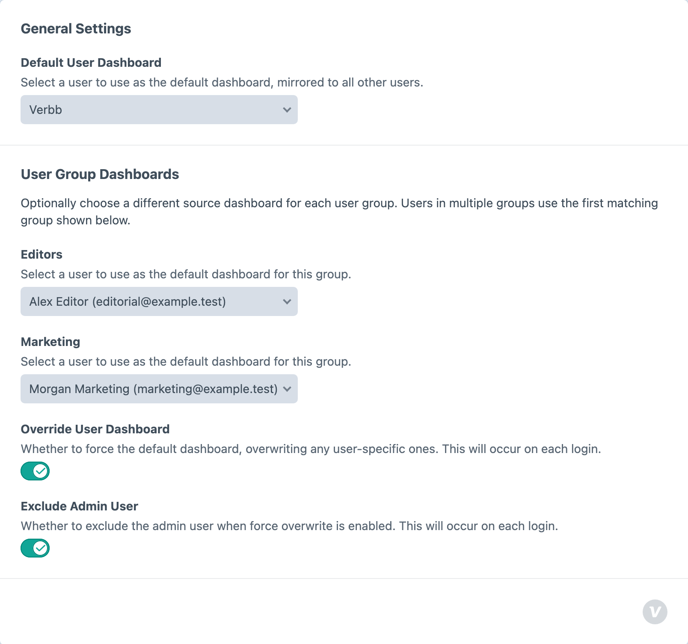

<!-- feature-intro -->
Default Dashboard gives Craft users a useful dashboard from their first sign-in. Define the widgets once, tailor defaults by user group when needed, and stop configuring every account by hand.
<!-- feature-intro-end -->

<!-- feature-section -->
## A better first login

An empty dashboard is not much of a welcome. Build a shared set of widgets around the way the project actually works, and new users arrive to useful shortcuts, guidance and information from their first login.

<!-- feature-section-end -->

<!-- feature-grid -->
- :icon[users-group] **Group-specific layouts** Give different user groups their own source dashboard, with a global fallback.
- :icon[layout-dashboard] **Respect personal layouts** Use the shared dashboard as a starting point or keep enforcing it after users make changes.
- :icon[user-shield] **Admin exclusions** Leave administrator dashboards untouched when they need a different operational view.
<!-- feature-grid-end -->

<!-- feature-section media-size="large" -->
## Configure it once

Choose whether the shared layout should replace a user’s existing widgets or only fill an empty dashboard. Administrators avoid repeating the same setup account by account, while editors continue working through Craft’s normal dashboard interface.

<!-- feature-section-end -->
